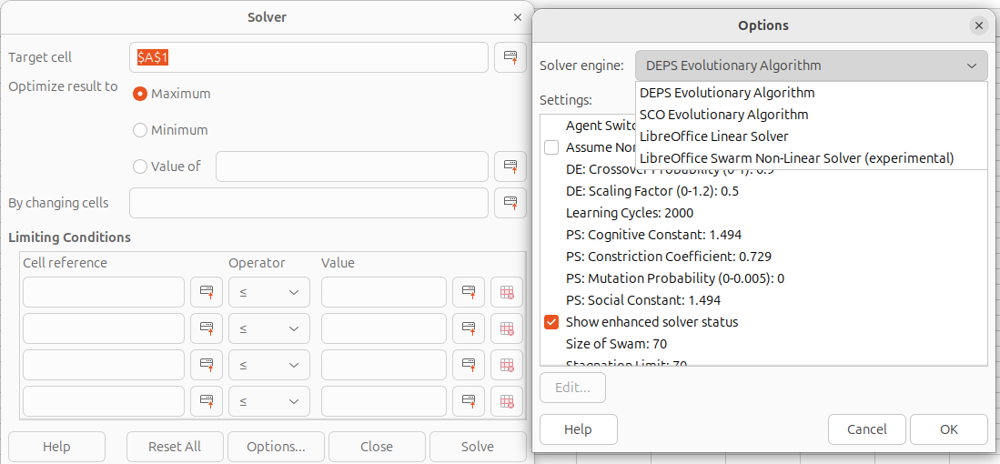

# Making `java` based extensions work

With new JAVA runtimes old extensions are losing comptability with Libreoffice. For instance in the `extensions` folder of this repo you will find non-linea solver extension & multiple chemical engineering extensions. After upgrading to `noble` from `jammy` they stopped working because JAVA runtimes became updated

## Legacy JAVA runtime
Install following
```
sudo apt install openjdk-8-jre libreoffice-java-common libunoloader-java 
```
Then you will be able to get legacy extensions to work with Librecalc

Ensure that Libreoffice detects correct JAVA vesion. If you have multiple choose `1.8x` 


Non-linear solver plugin working


