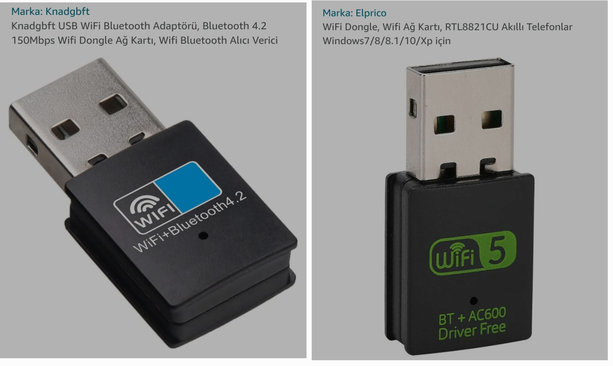

# Peripherals I bought 
To make modules for any peripheral to be attached with SBC it is compulsory to install kernel heders. If you are making Armbian or any other OS `.img` during compile time pass this flag `HEADERS_INSTALL=yes` 

## BT / WIFI 
The onboard Broadcom AP6256 BT / WIFI chip has good WIFI but poor BT especially for audio streaming; for general purpose keyboard / mouse connectivity it's OK. AP6256 discovers my 5.0GHz WIFI but connection is very unstable. It is stable at 2.5GHz



I bought both of these the blue one [left] is BT4.X & WIFI 2.5GHz while the green one [right] is BT5.X & WIFI 5.0GHz. Buy the **right** one as the BT / WIFI is superb just use USB3 port to plug it for stability. 

You can see WIFI connection information using `iwconfig`

### Old WIFI / BT kernel module 
Preferred for left device
```
https://github.com/et020598/rtl8723du

tar -xvf 20210324_LINUX_BT_DRIVER_RTL8723D_COEX_v3b3b.tar.gz
sudo make install INTERFACE=usb
sudo insmod /lib/modules/$(uname -r)/kernel/drivers/bluetooth/rtk_btusb.ko
reboot
```
Both the USB chips will work with above kernel module with full functionality i.e WIFI / BT, however, 5.0GHz WIFI is again unstable

### New WIFI / BT kernel module
Preferred for right device


This device when connected to SBC has [x2 modes](https://github.com/morrownr/8821cu-20210916/issues/92) a bootable USB mode & WIFI / BT dongle module. Due to the first mode **you may not be able to boot the SBC if it is connected at boot time**. When the SBC is running & you plug it in `lsusb` outputs
> Bus 007 Device 002: ID 0bda:1a2b Realtek Semiconductor Corp. RTL8188GU 802.11n WLAN Adapter (Driver CDROM Mode)

To switch its mode to dongle we have to do
```
sudo apt install usb-modeswitch
# v:p values from above output
sudo usb_modeswitch -KW -v 0bda -p 1a2b
```
then `lsusb` outputs
> Bus 007 Device 003: ID 0bda:c820 Realtek Semiconductor Corp. 802.11ac NIC

To make changes permanent `sudo nano /lib/udev/rules.d/40-usb_modeswitch.rules` add following before `LABEL="modeswitch_rules_end"`

> ATTR{idVendor}=="0bda", ATTR{idProduct}=="1a2b", RUN+="/usr/sbin/usb_modeswitch -K -v 0bda -p 1a2b"

To see if default BT & USB BT / WIFI are active
```
ukhan@orangepi3b:~$ hciconfig
hci1:	Type: Primary  Bus: USB # <- EXTERNAL DONGLE
	BD Address: 90:DE:80:17:E3:AE  ACL MTU: 1021:8  SCO MTU: 255:12
	UP RUNNING 
	RX bytes:4056 acl:0 sco:0 events:168 errors:0
	TX bytes:25296 acl:0 sco:0 commands:157 errors:0

hci0:	Type: Primary  Bus: UART
	BD Address: 54:78:C9:0E:17:AF  ACL MTU: 1021:8  SCO MTU: 64:1
	UP RUNNING PSCAN 
	RX bytes:136586 acl:6357 sco:0 events:317 errors:0
	TX bytes:50125 acl:62 sco:0 commands:281 errors:0
ukhan@orangepi3b:~$ nmcli
wlx90de8017e3ad: connected to khan 5G_Plus_5G # <- EXTERNAL DONGLE
        "Realtek Wi-Fi"
        wifi (rtw_8821cu), 90:DE:80:17:E3:AD, hw, mtu 1500
        ip4 default
        inet4 192.168.1.21/24
        route4 default via xxx metric 600
        route4 xxx metric 600
        inet6 fe80::9d6c:40d9:7c35:de53/64
        route6 fe80::/64 metric 1024

wlan0: disconnected
        "Broadcom Wi-Fi"
        wifi (brcmfmac), 54:78:C9:0E:17:AE, hw, mtu 1500

p2p-dev-wlan0: disconnected
        "p2p-dev-wlan0"
        wifi-p2p, hw

eth0: unavailable
        "eth0"
        ethernet (rk_gmac-dwmac), C6:92:4D:31:27:BC, hw, mtu 1500

lo: unmanaged
        "lo"
        loopback (unknown), 00:00:00:00:00:00, sw, mtu 65536

```

Now you can use `bluetoothctl` to issue commands & select each BT device separately & add devices to these BT controllers separately because Gnome don't provide a separate BT panel GUI as is the case with WIFI. For instance look for commands 
```
select 90:DE:80:17:E3:AE
scan on
# list of devices
add 28:C2:DD:1D:37:C4
trust 28:C2:DD:1D:37:C4
```
Per my experience [this driver](https://github.com/morrownr/8821cu-20210916) is more stable when it comes to WIFI 5.0GHz
```
git clone https://github.com/morrownr/8821cu-20210916
sudo sh remove-driver.sh
sudo sh install-driver.sh
sudo dkms status
# rtl8821cu/5.12.0.4, 6.1.75-vendor-rk35xx, aarch64: installed
sudo reboot
```
